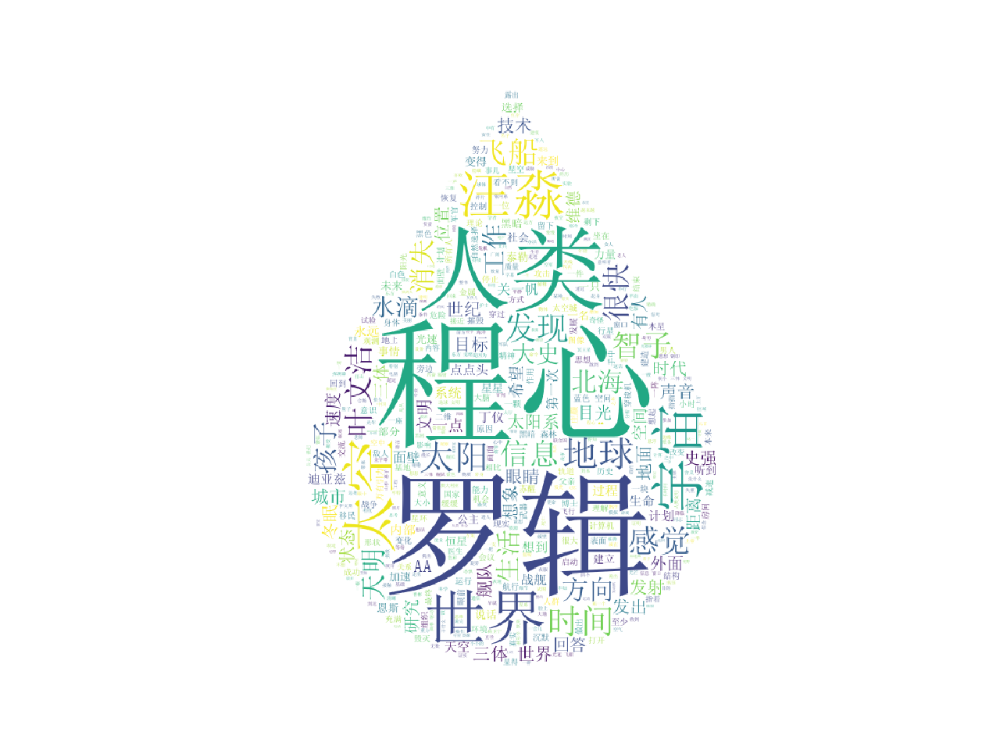

# wordcloud
中文文本的词云生成（以《三体》为例）

## 环境
`wordcloud`,`jieba`,`matplotlib`,`numpy`,`PIL`

## 实现步骤
#### 1.将中文文本的分词操作

由于中文不同于外文，每个词语中间没有分隔这一特点，需要先对文本分词

这里调用的是[jieba](https://github.com/fxsjy/jieba)库
```python
# 对句子进行分词  
def seg_sentence(sentence):  
    sentence_seged = jieba.cut(sentence.strip())  #strip()用来消除前后的空格
    outstr = ''  
    for word in sentence_seged:    
      if word != '\t':  
        utstr += word  
        outstr += " "     #去掉制表符并用空格分隔各词
    return outstr 
 ```
### 2.引入停词表

所谓停词表就是中文中一些没有实际意义或者对于项目不相关的词语，比如的、吗、一个什么的

这里使用[dongxiexidian](https://github.com/dongxiexidian/Chinese/blob/master/stopwords.dat)的停词表并做了修改

```python
# 创建停用词list  
def stopwordslist(filepath):  
    stopwords = [line.strip() for line in open(filepath, 'r', encoding='utf-8').readlines()]  
    return stopwords  
 ```
 
 ### 3.将分词的结果过滤停词表
  
 改写上面的`seg_sentence`方法
 
 ```python
def seg_sentence(sentence):  
    sentence_seged = jieba.cut(sentence.strip())  
    stopwords = stopwordslist('./resource/stopword.txt')  # 这里加载停用词的路径  
    outstr = ''  
    for word in sentence_seged:  
        if word not in stopwords:  
            if word != '\t':  
                outstr += word  
                outstr += " "  
    return outstr 
 ```
  ### 4.输入文本与分词表生成词图
  
  文本使用的是大刘的《三体》三部曲的txt，资源可自行在网上搜索。建议搜索的结果只用作研究用途，如想阅读请购买正版。
  

  ```python
  import jieba
  from wordcloud import WordCloud
  import matplotlib.pyplot as plt
  import numpy as np
  from PIL import Image
  
  inputs = open('../data/threebody.txt', 'r', encoding='utf-16')  #我的txt编码是utf-16，一般是utf-8或者gbk
  outputs = open('output.txt', 'w')  
  for line in inputs:  
      line_seg = seg_sentence(line)  # 这里的返回值是字符串  
      outputs.write(line_seg + '\n')  # 将分词和过滤停词表的文本保存
  outputs.close()  
  inputs.close()

  mask_img = np.array(Image.open("./resource/mask.jpg")) # 此为背景图形，我选用的是水滴图案
  inputs = open('output.txt', 'r', encoding='utf-8')
  mytext=inputs.read()
   wordcloud=WordCloud(background_color="white",max_words=500,width=2000,height=1600,margin=2,font_path="./resource/simsun.ttf",mask=mask_img).generate(mytext) #生成云图
  plt.imshow(wordcloud)
  plt.axis("off")
  plt.show()
```

得到的最终结果如下：



  
